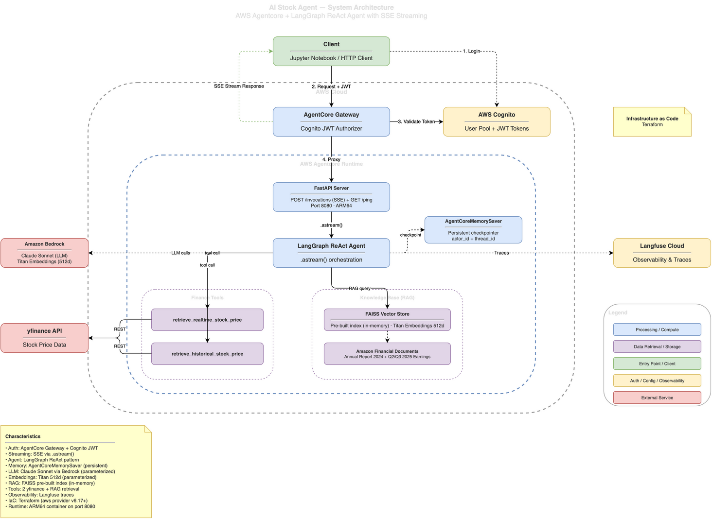

# AI Stock Agent on AWS Bedrock AgentCore

A LangGraph ReAct agent deployed on AWS Bedrock AgentCore that answers real-time and historical stock price queries via SSE streaming. The agent exposes two yfinance tools and a FAISS-backed RAG tool over Amazon financial documents. Authentication flows through Cognito JWT via the AgentCore Gateway, observability through Langfuse Cloud, and infrastructure is provisioned with Terraform.

---

## Architecture

### System Overview



### ReAct Agent Flow


> Diagrams source: [`docs/diagrams/system-architecture.drawio`](docs/diagrams/system-architecture.drawio)

---

## Prerequisites

| Tool | Version | Purpose |
| --- | --- | --- |
| Python | >= 3.12 | Runtime |
| [UV](https://docs.astral.sh/uv/) | >= 0.7 | Package manager |
| [Terraform](https://www.terraform.io/) | >= 1.14 | Infrastructure provisioning |
| [Docker](https://www.docker.com/) | Latest | Container build (ARM64 support required) |
| AWS CLI | v2 | Authentication + ECR login |
| AWS Account | — | Bedrock model access enabled for Claude Sonnet + Titan Embeddings |

### AWS Model Access

Before deploying, ensure the following Bedrock models are enabled in your AWS account (region `us-east-1`):

- **Claude Sonnet** (`anthropic.claude-sonnet-4-20250514`) — Chat LLM
- **Titan Embeddings V2** (`amazon.titan-embed-text-v2:0`) — Document embeddings

Enable them in the [Bedrock Model Access console](https://console.aws.amazon.com/bedrock/home#/modelaccess).

---

## Quick Start

```bash
# 1. Clone and install
git clone <repo-url>
cd ai-stock-agents-challenge
make install

# 2. Configure environment
cp .env.example .env
# Edit .env with your AWS region, Langfuse keys, etc.

# 3. Build the FAISS index (requires AWS credentials for Titan embeddings)
make build-index

# 4. Run locally
make dev-api
# Server at http://localhost:8080

# 5. Test
curl http://localhost:8080/ping
curl -N -X POST http://localhost:8080/invocations \
  -H "Content-Type: application/json" \
  -d '{"prompt": "What is the stock price for Amazon right now?"}'
```

---

## Deployment

### Step 1: Bootstrap Terraform State (first time only)

S3 bucket names are globally unique. Pick a name for your tfstate bucket and run:

```bash
# From the project root — creates the S3 bucket for Terraform remote state
bash terraform/bootstrap.sh <your-tfstate-bucket-name>
```

Then open `terraform/providers.tf` and replace the placeholder in the backend block with your bucket name:

```hcl
backend "s3" {
  bucket = "<your-tfstate-bucket-name>"  # ← replace this
  ...
}
```

> **Tip:** If the AWS CLI opens a pager showing the output with `(END)` at the bottom, press `q` to exit. To disable the pager globally, run `export AWS_PAGER=""`.

### Step 2: Configure Terraform Variables

```bash
cd terraform
cp terraform.tfvars.example terraform.tfvars
```

Edit `terraform.tfvars` with your values:

| Variable | Required | How to get it |
| --- | --- | --- |
| `aws_region` | Yes | AWS region with Bedrock + AgentCore support (default: `us-east-1`) |
| `project_name` | Yes | Prefix for all resource names (default: `ai-stock-agent`) |
| `container_image_tag` | Yes | Tag you pushed to ECR (e.g. `latest`, `v4`) |
| `bedrock_model_id` | Yes | Inference profile ID — run `aws bedrock list-inference-profiles` |
| `embedding_model_id` | Yes | Default: `amazon.titan-embed-text-v2:0` |
| `embedding_dims` | Yes | Default: `512` |
| `langfuse_public_key` | No | From [Langfuse Cloud](https://cloud.langfuse.com) → Settings → API Keys |
| `langfuse_secret_key` | No | Same as above (leave empty to disable tracing) |
| `langfuse_host` | No | Default: `https://cloud.langfuse.com` |

> **Note:** `terraform.tfvars` is gitignored — your secrets stay out of version control.

### Step 3: Initialize and Deploy Infrastructure

```bash
terraform init
terraform plan
terraform apply
```

This provisions: Cognito User Pool, ECR Repository, IAM Roles, AgentCore Runtime, Endpoint, Memory, and Gateway. The endpoint version is auto-synced to the latest runtime version on every apply.

Save the outputs — you'll need them for Docker push and the notebook:

```bash
terraform output
```

### Step 4: Build and Push Docker Image

```bash
# Build ARM64 image
make build

# Authenticate with ECR
aws ecr get-login-password --region us-east-1 | \
  docker login --username AWS --password-stdin $(terraform -chdir=terraform output -raw ecr_repository_url | cut -d/ -f1)

# Tag and push to ECR
ECR_REPO=$(terraform -chdir=terraform output -raw ecr_repository_url) make push

# Update container_image_tag in terraform.tfvars if using a new tag, then re-apply
cd terraform && terraform apply
```

### Step 5: Create a Cognito Test User

```bash
aws cognito-idp admin-create-user --user-pool-id $(terraform -chdir=terraform output -raw cognito_user_pool_id) --username testuser@example.com --temporary-password 'TempPass1!' --region us-east-1 --message-action SUPPRESS

aws cognito-idp admin-set-user-password --user-pool-id $(terraform -chdir=terraform output -raw cognito_user_pool_id) --username testuser@example.com --password 'securePass1' --region us-east-1 --permanent
```

### Step 6: Verify Deployment

The AgentCore Runtime is invoked via the AWS SDK (not direct HTTP). Use Python:

```python
import boto3, json

# Split the endpoint ARN into runtime ARN + qualifier
endpoint_arn = "<runtime_endpoint_arn from terraform output>"
runtime_arn, qualifier = endpoint_arn.split("/runtime-endpoint/")

client = boto3.client("bedrock-agentcore", region_name="us-east-1")
response = client.invoke_agent_runtime(
    agentRuntimeArn=runtime_arn,
    qualifier=qualifier,
    runtimeSessionId="test-session",
    contentType="application/json",
    accept="text/event-stream",
    payload=json.dumps({"prompt": "What is the stock price for Amazon right now?", "stream": True}).encode(),
)

for line in response["response"].iter_lines():
    decoded = line.decode("utf-8") if isinstance(line, bytes) else line
    if decoded.startswith("data: "):
        data = json.loads(decoded[6:])
        if data.get("type") == "token":
            print(data["content"], end="", flush=True)
        elif data.get("type") == "end":
            break
print()
```

> **Note:** The caller's IAM identity needs `bedrock-agentcore:InvokeAgentRuntime` permission.
> The Cognito Gateway is for MCP-protocol clients; for direct invocation, use the SDK.

---

## Running the Demo Notebook

### 1. Install the Jupyter kernel (first time only)

```bash
uv run python -m ipykernel install --user --name ai-stock-agent --display-name "AI Stock Agent (Python 3.12)"
```

### 2. Create the notebook environment file

```bash
cp .env.notebook.example .env.notebook
```

Edit `.env.notebook` with your actual Terraform outputs:

```bash
# Fill in values from terraform output
terraform -chdir=terraform output
```

| Variable | How to get it |
| --- | --- |
| `AWS_PROFILE` | AWS CLI profile name (or set `AWS_ACCESS_KEY_ID` / `AWS_SECRET_ACCESS_KEY` instead) |
| `RUNTIME_ENDPOINT_ARN` | `terraform -chdir=terraform output -raw runtime_endpoint_arn` |
| `COGNITO_USER_POOL_ID` | `terraform -chdir=terraform output -raw cognito_user_pool_id` |
| `COGNITO_CLIENT_ID` | `terraform -chdir=terraform output -raw cognito_client_id` |
| `COGNITO_USERNAME` | The Cognito user you created in Step 5 |
| `COGNITO_PASSWORD` | The permanent password you set in Step 5 |

### 3. Launch the notebook

Open `notebooks/demo.ipynb` in Cursor/VS Code or Jupyter, select the **"AI Stock Agent (Python 3.12)"** kernel, and run all cells. The notebook loads configuration from `.env.notebook` automatically.

The notebook runs all 5 required queries:

1. **Real-time price** — "What is the stock price for Amazon right now?"
2. **Historical prices** — "What were the stock prices for Amazon in Q4 last year?"
3. **Cross-reference** — "Compare Amazon's recent stock performance to what analysts predicted in their reports"
4. **Multi-source** — "I'm researching AMZN -- give me the current price and any relevant information about their AI business"
5. **Document-only** — "What is the total amount of office space Amazon owned in North America in 2024?"

Plus a multi-turn conversation demo and Langfuse trace display.

---

## Makefile Targets

Run these in order for a full deployment workflow:

| Target | Command | Description |
| --- | --- | --- |
| `install` | `make install` | Install Python dependencies (UV) |
| `lint` | `make lint` | Run Ruff linter on `src/` |
| `format` | `make format` | Auto-format with Ruff |
| `test` | `make test` | Run integration tests (no server needed) |
| `build-index` | `make build-index` | Build FAISS index from PDFs |
| `dev-api` | `make dev-api` | Start local dev server (port 8080, hot reload) |
| `build` | `make build` | Build ARM64 Docker image |
| `push` | `make push` | Tag and push image to ECR |
| `apply` | `make apply` | Run `terraform apply` |

---

## Project Structure

```text
src/ai_stock_agent/
├── domain/                     # Pure Python, no framework dependencies
│   ├── entities.py             # StockPrice, DocumentChunk value objects
│   ├── ports/
│   │   ├── inbound.py          # AgentPort use case interface
│   │   └── outbound/           # Adapter interfaces (ILLMProvider, IStockProvider, etc.)
│   └── use_cases/
│       └── invoke_agent.py     # Orchestrates graph invocation + SSE streaming
├── adapters/
│   ├── inbound/
│   │   ├── api.py              # FastAPI routes: POST /invocations, GET /ping
│   │   └── schemas.py          # Pydantic request/response DTOs
│   └── outbound/
│       ├── bedrock_llm.py      # ChatBedrock adapter
│       ├── bedrock_embedder.py # Titan embeddings adapter
│       ├── yfinance_stock.py   # yfinance stock data adapter
│       └── faiss_retriever.py  # FAISS vector retriever adapter
└── infrastructure/
    ├── app.py                  # FastAPI lifespan, DI wiring (composition root)
    ├── config.py               # Pydantic Settings (env-based config)
    ├── graph.py                # LangGraph StateGraph definition
    └── tools.py                # LangGraph @tool wrappers

terraform/                      # IaC: AgentCore, Cognito, ECR, IAM
notebooks/demo.ipynb            # Demonstration notebook (5 queries + auth + traces)
scripts/build_index.py          # FAISS index builder from PDFs
prompts/system.md               # Agent system prompt
tests/
├── integration/                # Tool, retriever, API tests (no server)
└── e2e/                        # Acceptance, streaming, memory, LLM eval tests
```

---

## Configuration

All configuration is via environment variables (see `.env.example`):

| Variable | Default | Description |
| --- | --- | --- |
| `AWS_REGION` | `us-east-1` | AWS region for Bedrock and AgentCore |
| `BEDROCK_MODEL_ID` | `us.anthropic.claude-sonnet-4-20250514-v1:0` | Chat LLM (inference profile ID) |
| `EMBEDDING_MODEL_ID` | `amazon.titan-embed-text-v2:0` | Embedding model |
| `EMBEDDING_DIMS` | `512` | Embedding dimensions |
| `AGENTCORE_MEMORY_ID` | *(empty)* | AgentCore Memory ARN (empty = in-memory) |
| `LANGFUSE_PUBLIC_KEY` | *(empty)* | Langfuse public key (empty = tracing off) |
| `LANGFUSE_SECRET_KEY` | *(empty)* | Langfuse secret key |
| `LANGFUSE_HOST` | `https://cloud.langfuse.com` | Langfuse host URL |
| `FAISS_INDEX_PATH` | `data/faiss_index` | Path to pre-built FAISS index |
| `CHUNK_SIZE` | `1500` | Document chunk size (chars) |
| `CHUNK_OVERLAP` | `300` | Chunk overlap (chars) |
| `RETRIEVER_K` | `5` | Number of chunks to retrieve |
| `HOST` | `0.0.0.0` | Server bind address |
| `PORT` | `8080` | Server bind port |
| `AGENT_ACTOR_ID` | `ai-stock-agent` | Actor ID for memory checkpointer |

---

## Testing

```bash
# Integration tests (no server, no LLM — runs on every commit)
make test

# E2E acceptance tests (requires running server)
make dev-api  # in one terminal
pytest -m e2e -v  # in another terminal

# LLM evaluation tests (requires running server + Bedrock access)
pytest -m llm -v

# Against deployed endpoint (requires RUNTIME_ENDPOINT_ARN env var)
RUNTIME_ENDPOINT_ARN=<arn> pytest -m e2e -v
```

---

## Technology Stack

| Component | Technology |
| --- | --- |
| Agent Framework | LangGraph (ReAct pattern) |
| LLM | Claude Sonnet via AWS Bedrock |
| Embeddings | Titan Embeddings V2 (512d) |
| Vector Store | FAISS (pre-built, in-container) |
| Stock Data | yfinance |
| Memory | AgentCoreMemorySaver |
| API | FastAPI (SSE streaming) |
| Auth | Cognito JWT via AgentCore Gateway |
| Observability | Langfuse Cloud |
| Infrastructure | Terraform (`aws-ia/agentcore/aws` module) |
| Container | Docker ARM64 (Graviton) |
| Package Manager | UV |
| Code Quality | Ruff |

---

## Teardown

To destroy all AWS resources when you're done:

```bash
# 1. Destroy all Terraform-managed resources (AgentCore, Cognito, ECR, IAM, etc.)
cd terraform
terraform destroy

# 2. Delete the S3 bucket used for Terraform remote state
#    Replace <your-tfstate-bucket-name> with the name you used in bootstrap.sh
aws s3 rm s3://<your-tfstate-bucket-name> --recursive
aws s3api delete-bucket --bucket <your-tfstate-bucket-name> --region us-east-1
```

> **Note:** The S3 bucket has versioning enabled. If `aws s3 rm` doesn't fully empty it, delete all object versions first:
>
> ```bash
> BUCKET=<your-tfstate-bucket-name>
> aws s3api list-object-versions --bucket $BUCKET --query '{Objects: Versions[].{Key:Key,VersionId:VersionId}}' --output json | \
>   aws s3api delete-objects --bucket $BUCKET --delete file:///dev/stdin
> aws s3api list-object-versions --bucket $BUCKET --query '{Objects: DeleteMarkers[].{Key:Key,VersionId:VersionId}}' --output json | \
>   aws s3api delete-objects --bucket $BUCKET --delete file:///dev/stdin
> aws s3api delete-bucket --bucket $BUCKET --region us-east-1
> ```

---

## License

This project is licensed under the [MIT License](LICENSE).
